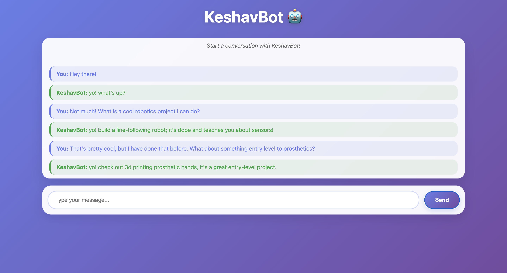

# 🤖 KeshavBot

KeshavBot is a personalized chatbot web app built using **Flask** (Python backend) and **HTML/CSS/JS** (frontend). It uses the OpenAI API to generate short, casual one-sentence responses based on Keshav's personality and background.



---

## 🌟 Features

- Chat with a personalized AI trained on Keshav's info
- Friendly, one-sentence responses under 20 tokens
- Modern web interface with live user interaction
- Uses OpenAI's GPT-4o model via API

---

## 🚀 Technologies Used

- 🧠 OpenAI GPT API (via `openai` Python SDK)
- 🐍 Flask (Python backend)
- 🌐 HTML, CSS, JavaScript (frontend)
- 🌱 dotenv for secure API key handling
- 🔁 Flask-CORS for cross-origin requests

---

## 🛠️ Setup Instructions


```bash
### 1. Clone the Repository
git clone https://github.com/KeshavMalhotra10/chatbot.git
cd chatbot

### 2. Create the virtual environment
python -m venv venv
source venv/bin/activate   # on Windows: venv\Scripts\activate

### 3. Install Requirements 
pip3 install openai, dotenv, flask, flask_cors

### 4. Create a .env file in the root folder
OPENAI_API_KEY=your_openai_key_here

### 5. Create a info.txt file and populate with your own info

### 6. Run the app using flask
python main.py

### 7. Open the local host link provided(Enter url into browser)

### 8. Here is the project structure:

chatbot/
├── main.py            ✅ Flask backend
├── info.txt           ✅ Background data for the chatbot (In gitignore to protect personal info)
├── .env               ✅ Your OpenAI API key (keep this secre, should be in gitignore)
├── .gitignore         ✅ Excludes venv, .env, etc.
├── README.md          ✅ Project info
├── templates/         ✅ HTML files go here (e.g., index.html)
└── venv/              ✅ Virtual environment (should be in .gitignore)
